<h1>
  <picture>
    <source media="(prefers-color-scheme: dark)" srcset="docs/brand/freegaz-wordmark-night.svg">
    
  </picture>
</h1>

**The indoor trainer app that doesn't send you a bill every month.**

You bought the smart trainer. You bought the bike. You turned a corner of the garage into a pain cave, complete with a fan older than your car. Then an app asked for a monthly subscription so you could pedal. In your garage. On the trainer you already paid for. Going nowhere.

FreeGaz is free. No subscription, no "Premium" tier, no annual plan with the cancel button hidden four menus deep, and no "your trial has ended" email on the morning of your FTP test. ERG, workouts, FTP tests, routes, the builder, the charts and a coach who will call you a statue mid-interval: all of it, for the grand total of nothing. The only thing it charges is your legs.

It's a data-obsessed indoor cycling trainer for macOS. It drives your smart trainer in ERG, level, slope or heart-rate mode, plays and builds structured workouts, runs an FTP test that actually saves your FTP, rides real routes, and records every second on your Mac as a FIT file. Your rides stay yours.

<p align="center">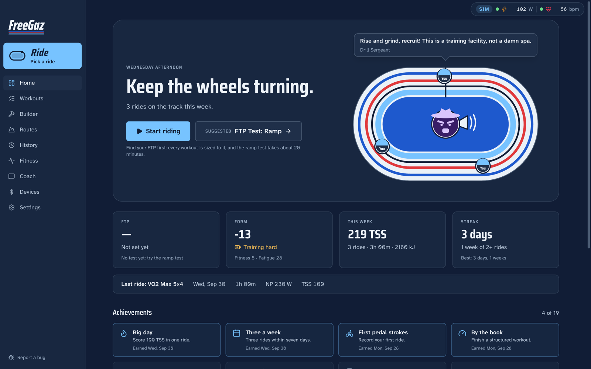</p>

> FreeGaz is not affiliated with or endorsed by FulGaz, Zwift, TrainerRoad or Wahoo. Product names are trademarks of their owners.

## A quick tour

**Home is a velodrome.** Every ride this week puts a rider on the boards (with your face, if you add a photo), and harder rides lap faster. Your coach stands in the infield with a megaphone, yelling at you to get on the bike. Haven't ridden yet this week? Another coach is already doing laps, and yours will make sure you hear about it.

**Pick a ride and go.** One big button, four choices, no forty-tab dashboard to decode before your warm-up.

<p align="center">
  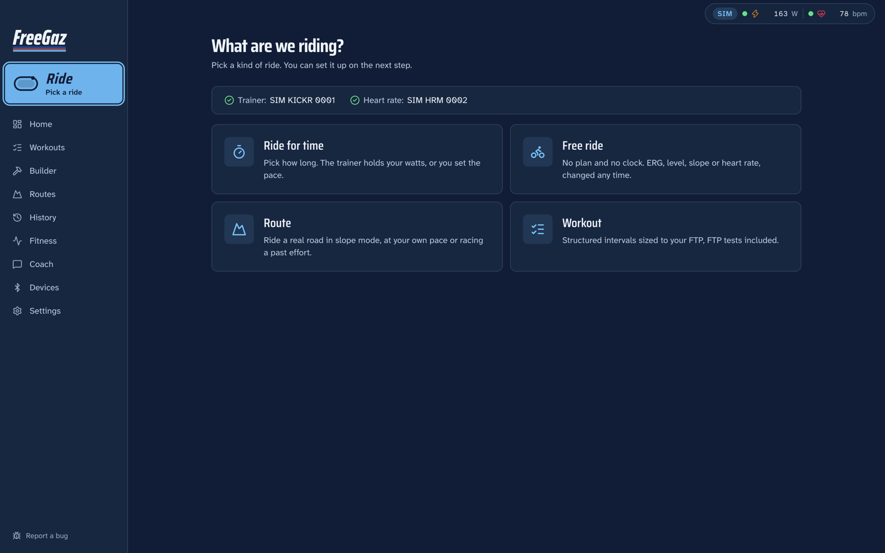
  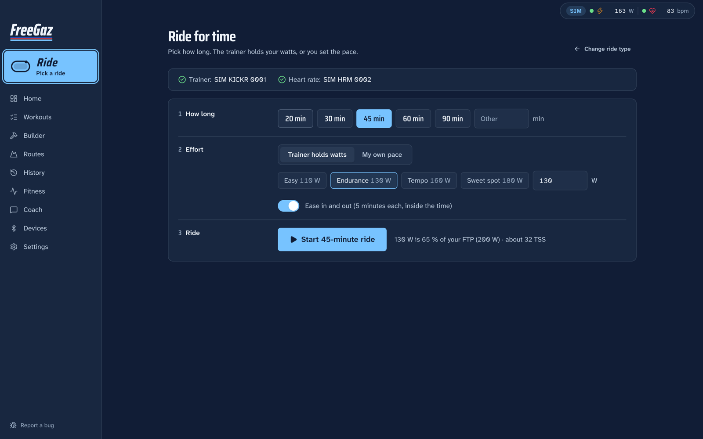
</p>

<p align="center">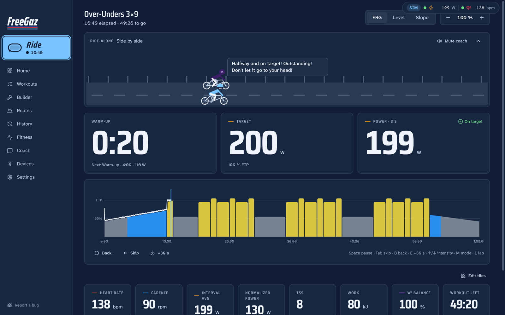</p>

**Your coach rides with you.** They pace at your target. Ease off and they ride away and tell you about it. Push and you drop them, which is the best feeling in indoor cycling.

<p align="center">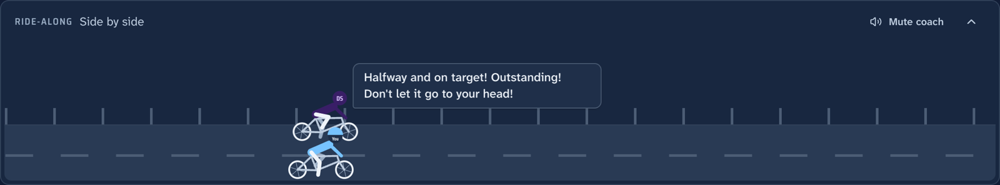</p>

**Ten coaches, five spice levels, three kinds of language.** From a calm Zen master to a drill sergeant, plus two famous podium voices doing their best impressions. Profanity goes from Clean to Mild to Unhinged. Unhinged means it.

<p align="center">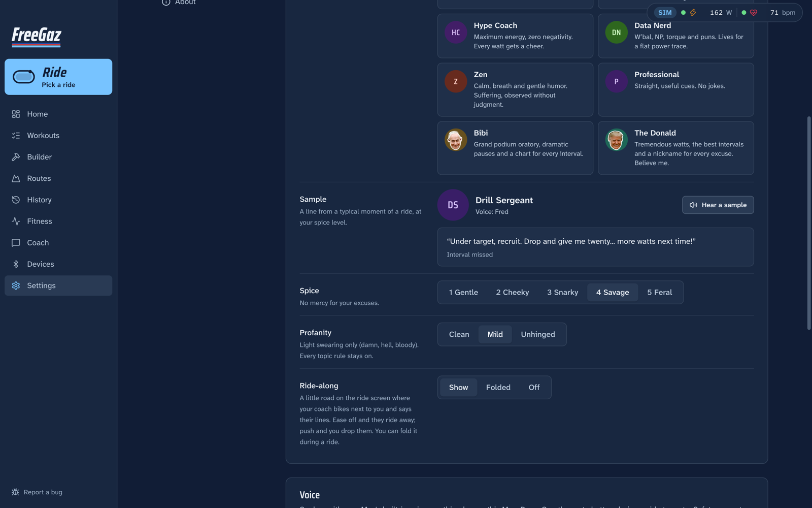</p>

**Workouts you can see before they hurt you,** on three shelves: FreeGaz's own workouts, your Custom ones, and a Training plan you put in order.

<p align="center">
  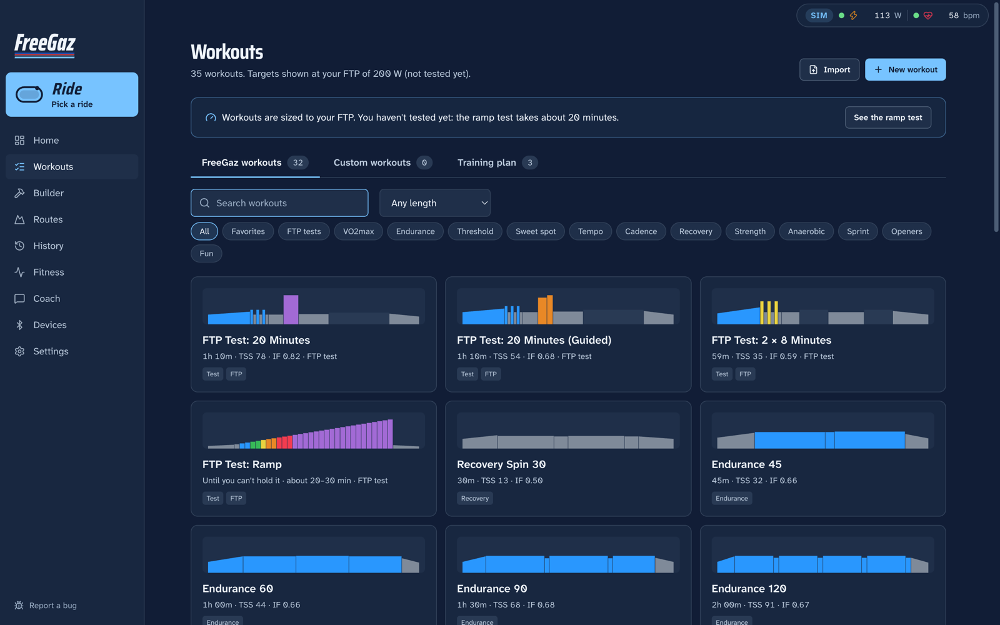
  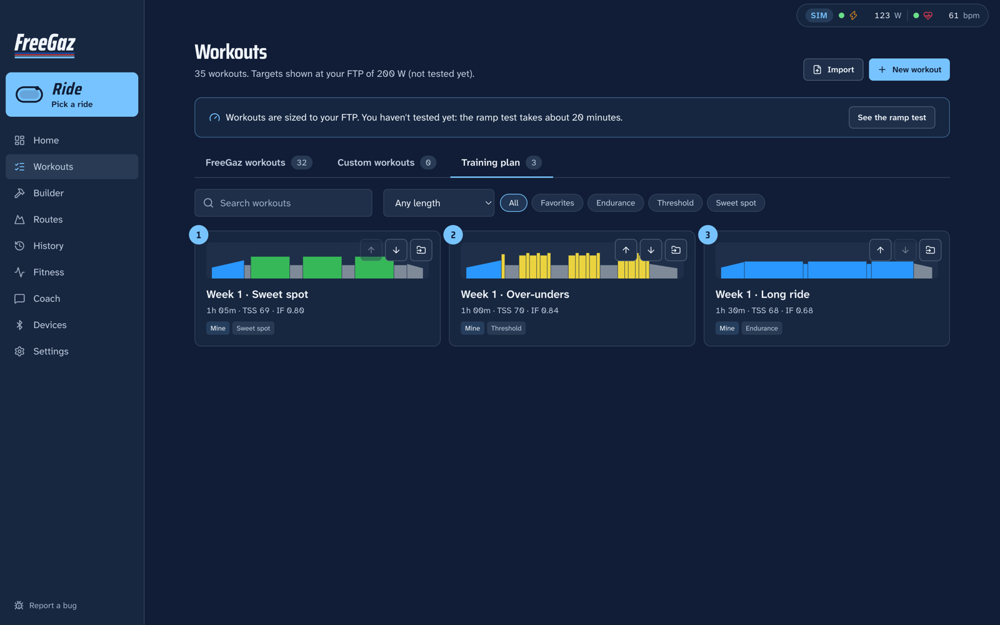
</p>

**And some workouts your old app would never have shipped.** The FreeGaz shelf includes eight rude ones, where the power chart is the joke. The Bird is four knuckles at threshold and a middle finger at 150 % FTP. Mount Stupid is the Dunning-Kruger curve. Stairway to Hell has no landing. Liar Liar says "last one" seven times. Sawtooth Motherfucker is exactly what it sounds like. The cues swear, bleeped to match your profanity setting.

<p align="center">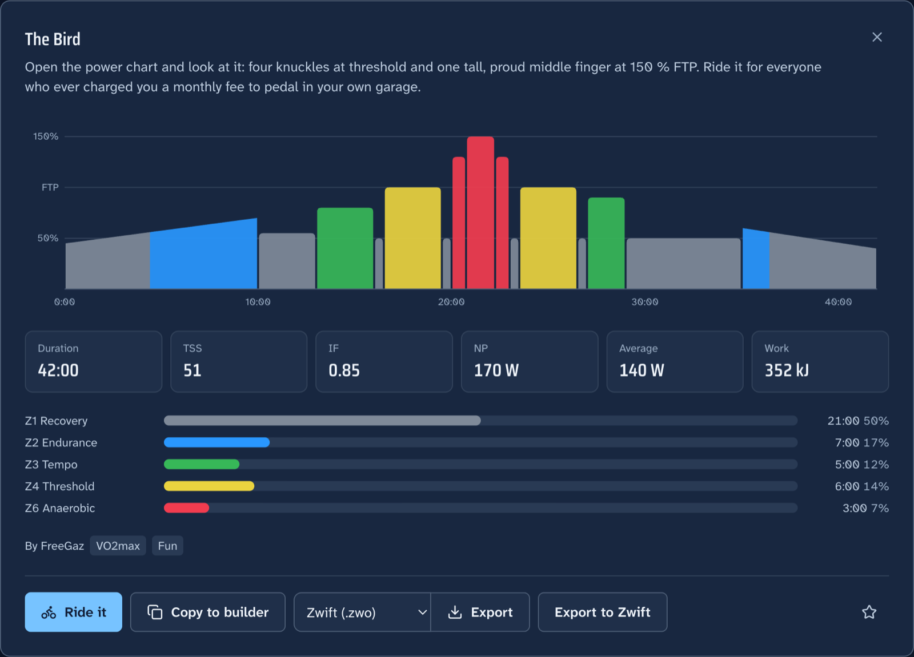</p>

**A builder for the ones nobody has written yet.** Drag blocks, type intervals.icu text, or describe it and let the AI write it. File it under Custom workouts or straight into your plan.

<p align="center">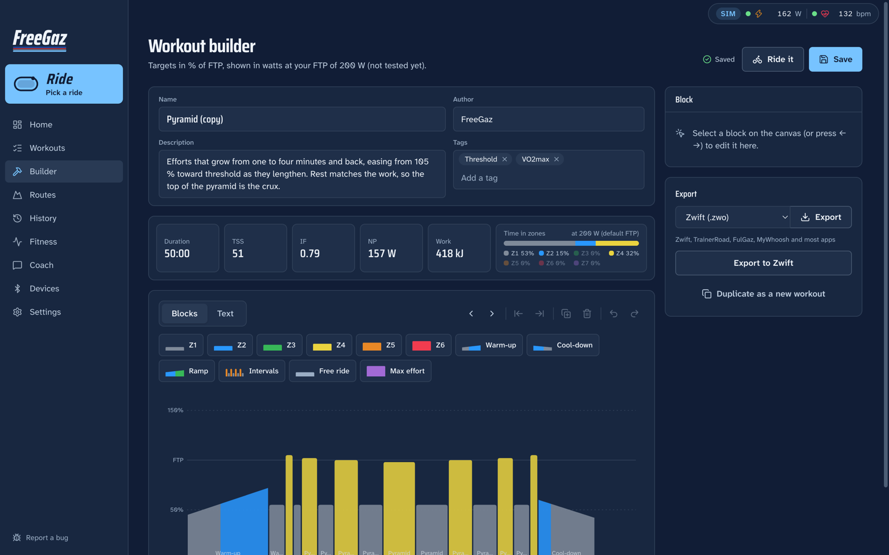</p>

**Real roads, real gradients.** Import a GPX and the trainer climbs when the road does. Race a ghost of your last attempt if you're feeling brave.

<p align="center">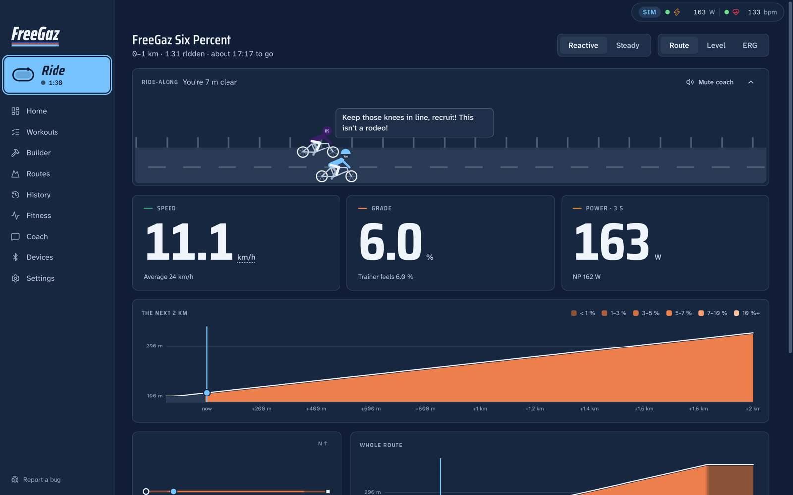</p>

**Light mode, for the sunny garage.**

<p align="center">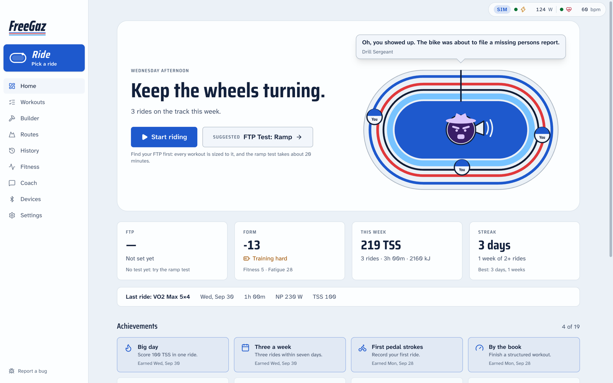</p>

## Everything it does

**Riding**
- **Pick a ride, then go.** The big **Ride** button at the top of the sidebar asks what kind of ride you want, with your trainer and heart-rate status up front:
  - **Ride for time:** 20 to 90 minutes (or any length), with the trainer holding your watts from Easy to Sweet spot, or at your own pace. Ease in and out if you like.
  - **Free ride**, a **route** or a **workout**, each a short list away.
  - While you ride, the button shows your moving time, and a little rider laps the velodrome on it.
- **Just ride.** ERG (the trainer holds the watts), Level (fixed resistance), Slope (a virtual gradient) or HR (the trainer adjusts watts to hold your heart rate). Switch any time with `M`.
- **ERG manners.**
  - A 10-second soft start.
  - A "spiral of death" guard: resistance is released when your cadence collapses.
  - One command per second with deadbands, and targets sent a second early to hide trainer lag.
  - Everything is re-applied after a reconnect.
- **Workouts.**
  - Skip, go back or repeat an interval, and extend one by 30 s.
  - Change the intensity in 1 % steps.
  - Ride any workout in Level or Slope mode instead of ERG.
  - Text cues appear as the workout reaches them, and every interval becomes a lap.
- **Interval rescue.** When a hard interval is failing, it offers 5 % easier or a 30-second breather instead of letting you bail.
- **FTP tests.**
  - **20-minute** (Allen & Coggan). During the effort ERG turns off: the trainer switches to a flat road and a pacing band and projected FTP guide you.
  - **Guided 20-minute**, with the blowout in ERG.
  - **8-minute.**
  - **Ramp.** It ends itself when you can't turn the pedals any more.
  - **Saving the result:** a valid, plausible result is saved automatically, with one-click undo. A drop of more than 3 %, a jump of more than 15 %, or a test with problems asks first. Simulated rides never change your FTP.
- **Routes.** Import GPX or TCX, and the trainer follows the elevation in three modes:
  - **Reactive:** your power drives the speed, through real physics.
  - **Steady:** the recorded pace.
  - **Challenge:** race a ghost of a previous ride.
- **Uphill/downhill scaling** (default 100 % / 50 %, with a 20 % limit) changes only how a climb feels. Speed always uses the true grade.

**Seeing everything**
- **HUD tiles.** Over 40 metrics in tiles you arrange and save per view, with presets:
  - **Power:** 3/10/30 s and interval averages, NP, IF, TSS, W/kg, % FTP, zone.
  - **W′ balance** and **L/R balance.**
  - **Heart rate:** HR zones, % max and % LTHR, decoupling, RMSSD and DFA-α1.
  - **Cadence** against its target band.
  - **Also:** kJ and carbs, time, speed, grade and what was sent to the trainer.
- **Mini-HUD.** An always-on-top panel you can float over Netflix.
- **Phone remote.** Off by default. When on, you scan a QR code; access needs a token and origin checks.
- **Alerts.** Personal-best toasts, and drink and eat reminders.
- **Music.** Spotify or Apple Music controls: `N` next, `Shift+N` previous, `P` play/pause.
- **Light or dark.** Pick in **Settings → Appearance**, or follow macOS. Charts and zone colours have their own validated steps for each theme; the mini-HUD stays dark so it reads over video.
- **Your units.** Metric or imperial, with speed (km/h or mph) and weight (kg or lb) set on their own. Tap the unit on the speed tile to flip it mid-ride.

**Building workouts**
- **Three shelves.** FreeGaz's own workouts, your Custom workouts, and your Training plan: a numbered list you put in order. Anything you build lands in Custom unless you file it in the plan.
- **A builder like zwofactory.com**, with blocks you can grab:
  - drag a block's edge to change its duration, or its top to change its power;
  - drag a block to reorder it;
  - an inspector for every field;
  - undo and redo;
  - live TSS, IF and zone totals at your FTP.
- **Text mode** uses intervals.icu syntax (`- 10m ramp 40-75%`, `4x`, `- 8m 95-100% 95rpm`), synced both ways with the blocks.
- **Rude workouts included:** The Bird, Both Barrels, Mount Stupid, Stairway to Hell, Shit Show, Sawtooth Motherfucker, Market Crash and Liar Liar, under the Fun filter.
- **Import and export:**
  - `.zwo`, `.mrc`, `.erg` and intervals.icu text;
  - **Export to Zwift** drops the file straight into Zwift's Custom Workouts.
- **Optional AI.** "45 minutes of over-unders, finish with sprints" becomes a workout you can edit.

**Coaching**
- **Ten personas**, each with a face (a cartoon, or for two of them, a photo caricature):
  - Drill Sergeant, Roast Comic, Disappointed Dad, The Overlord, Hype Coach, Data Nerd, Zen and Professional;
  - **Bibi**, podium style ("I have drawn a red line at 280 watts");
  - **The Donald**, rally style ("It's going to be a big, beautiful interval", "I'm putting a tariff on coasting").
- **The ride-along.** Your coach bikes next to you on a little road on the ride screen, pacing at your target. Ease off and they ride away; push and you drop them. Their lines pop up in a speech bubble. Fold it to a strip, or turn it off.
- **Caricatures for Bibi and The Donald.** A photo bobblehead on a little bike rides along and talks.
  - Bibi switches between three public photos, The Donald between four. The Donald's long red tie streams in the wind.
  - The head wiggles and the jaw flaps in time with the voice.
  - It stands still if macOS is set to reduce motion.
- **Spice** from 1 (gentle) to 5 (feral).
- **Profanity** in three levels: **Clean**, **Mild** (damn, hell, bloody) and **Unhinged** (as much as the coach can manage).
- **Mute** from the ride screen, or press `C`. Safety prompts still come through.
- **Voice.** Lines are spoken with a macOS voice, and the music is lowered while the coach talks.
- **Coach chat.** With an AI provider on, ask your coach about your training and they answer in character, at your spice and profanity levels.
- **Guardrails.** Your body, weight and health are never joke material. If your heart rate looks wrong, or you stop suddenly in a hard effort, every persona turns supportive.

**Your history**
- **A list or a calendar.** Every ride newest first, or a month at a time: each day's rides, days shaded by training load, and weekly hours and TSS.
- **Ride detail:** power, cadence, HR, speed and W′ balance charts, laps, time in zones, RPE and notes, and an AI debrief.
- **Fitness:** the PMC (fitness, fatigue, form), weekly load, the power curve against your 90-day best, and FTP history.
- **Fitness overview.** A plain-English read of those numbers: where your fitness is, the six-week trend, and whether your FTP needs a test. With AI on, your coach writes it, and **Ask the coach** takes it straight into the chat for questions.
- **Home.** The velodrome of this week's rides (or a rival coach doing laps while you don't), your coach shouting from the infield, a suggested workout, your FTP with a retest nudge, form, this week, your latest ride, and achievements and streaks.
- **You.** Add your name and a photo in **Settings → Athlete & FTP** and your own face rides the ride-along bike and laps the velodrome.
- **FIT files:**
  - every ride is saved as a FIT file in `~/Documents/FreeGaz/Rides`;
  - import old Garmin or Wahoo FIT files so your fitness charts are complete;
  - rebuild your history from the FIT folder.
- **Backups:** back up and restore everything as a zip.

## Install

Requirements: a Mac with Apple Silicon and Bluetooth.

**From a release:** download `FreeGaz-<version>-arm64.dmg` from [Releases](https://github.com/raytfitzgerald/FreeGaz/releases) and drag FreeGaz to Applications. The builds are ad-hoc signed, not notarized, so macOS will refuse the first launch. Either right-click **FreeGaz.app → Open**, or run:

```bash
xattr -dr com.apple.quarantine /Applications/FreeGaz.app
```

**From source** (Node 24+):

```bash
npm install
npm run dev
```

## First ride

1. **Free your trainer.** A KICKR accepts several Bluetooth connections but only one controller. Quit Zwift and the Wahoo app, and unpair any head unit that controls it. If something else grabs control, FreeGaz says so.
2. **Heart rate from a Garmin watch.** Turn on heart-rate broadcast: on most models it's **Settings → Health & Wellness (or Wrist Heart Rate) → Broadcast Heart Rate**. A chest strap needs no setup.
3. **Connect.** Open **Devices**, then **Connect trainer** and **Connect heart rate**, and pick each from the list. macOS asks for Bluetooth permission the first time. FreeGaz remembers your devices and reconnects them at launch.
4. **Tell it about you.** In **Settings → Athlete & FTP**, enter your weight and your FTP if you know it. If you don't, open **Workouts → FTP tests** and take the ramp test (about 20 minutes).
5. **Ride.** Press the big **Ride** button, pick a kind of ride and set it up. Press **Finish** when you're done; the ride is saved, and so is its FIT file.

### Keyboard

| Key | During a ride |
|---|---|
| `Space` | Pause / resume |
| `L` | Lap |
| `↑` / `↓` | Intensity ±1 % (`Shift`: ±5 %); in Level or Slope, harder or easier |
| `Tab` | Skip to the next interval |
| `B` | Back: restart this interval (twice for the previous one) |
| `E` | Extend this interval by 30 s |
| `M` | Cycle trainer mode |
| `C` | Mute the coach |
| `N` / `Shift+N` / `P` | Next / previous track, play / pause music |

## Connecting services (all optional)

**Strava.** Strava only lets each user connect their own API app, and since June 2026 creating one needs a **Strava subscription**.
1. Go to [strava.com/settings/api](https://www.strava.com/settings/api) and create an app. Set **Authorization Callback Domain** to `127.0.0.1`.
2. In FreeGaz, open **Settings → Strava & sync**. Paste the app's Client ID and Client Secret, press **Connect**, and approve in your browser.
3. Turn on auto-upload if you like. Rides go up as Virtual Rides and are marked as trainer rides.

FreeGaz only uploads. It never reads your Strava data. Without a subscription, use **Strava upload** on any ride: it opens Strava's upload page and shows you the FIT file to drag in.

**intervals.icu.** Paste your API key and athlete ID (from intervals.icu → Settings → Developer) in **Settings → Strava & sync**.

**Garmin Connect.** Drag a ride's FIT file into Garmin Connect's import page. There is no automatic upload.

**AI.** Open **Settings → AI** and pick one provider:
- **Claude:** an API key from [console.anthropic.com](https://console.anthropic.com). The default model is Claude Opus 5.5.
- **OpenAI:** an API key.
- **Grok (xAI):** an API key from [console.x.ai](https://console.x.ai).
- **Ollama:** runs on your Mac with no key. Install it from [ollama.com](https://ollama.com) and pull a model.

Keys are encrypted with your macOS Keychain and never reach the app's UI process. The AI only ever sees rides recorded on this Mac, never anything from Strava.

## Your data

Everything stays on this Mac. Rides live in the app's database, plus a FIT file per ride in `~/Documents/FreeGaz/Rides`; you can change that folder, for example to one in iCloud Drive for free sync. **Settings → Data & backup** saves or restores a full backup zip, or scans the FIT folder to rebuild your history on a new Mac. Nothing leaves the machine unless you connect Strava or intervals.icu, turn on an AI provider, or send a bug report.

## Reporting a bug

Use **Report a bug** at the bottom of the sidebar (or **Settings → About**). It opens a GitHub issue with your report and a few diagnostics filled in: app and macOS versions, device types and a few settings, never names or ride data. You can read and edit all of it before you submit. You can also [open an issue](https://github.com/raytfitzgerald/FreeGaz/issues/new/choose) directly.

## Building from source

| Command | What it does |
|---|---|
| `npm run dev` | Launch the app with hot reload (the main process restarts on its own changes) |
| `npm run dev:web` | Run the UI alone in a browser with simulated devices (no Electron) |
| `npm run check` | Typecheck + lint (with architecture boundaries) + unit and simulator tests |
| `npm run e2e` | Build, then run the Playwright Electron end-to-end suite |
| `npm run dist` | Build `release/<version>/FreeGaz-<version>-arm64.dmg` |
| `npm run selftest:packaged` | Boot the packaged app and round-trip one IPC call |
| `npm run licenses` | Verify every shipped dependency is MIT-compatible |
| `npm run icon` | Re-render the app icon |

To try it without hardware, `FREEGAZ_SIM=1 npm run dev` runs the app against a simulated KICKR and HR strap that speak real Bluetooth bytes. Add `FREEGAZ_WARP=10` to speed up time ten-fold; simulated and time-warped rides are always flagged, and never count towards Strava, fitness or FTP.

Ad-hoc signatures change on every build, so macOS forgets permission grants such as Bluetooth and Automation. To keep them, create a self-signed "Code Signing" certificate named `FreeGaz Local` in Keychain Access and build with `CSC_NAME="FreeGaz Local" npm run dist`.

### Architecture

- `src/core`: pure TypeScript domain logic, with no DOM, Node or Electron; ESLint and a dedicated tsconfig enforce that. It holds:
  - BLE codecs and drivers, the simulator, trainer control and PowerMatch;
  - workouts, routes, ride recording, metrics, physics and FIT;
  - the coaching engine.
- `src/main`: the Electron main process. It owns:
  - windows and the Bluetooth device chooser;
  - the crash-safe ride journal and files;
  - secrets (macOS Keychain via `safeStorage`);
  - Strava and intervals.icu, AI, music, and the phone remote.
- `src/preload`: a small bridge that exposes `window.freegaz` (typed `invoke` / `on`) for allowlisted channels only.
- `src/renderer`: the React UI and the ride engine. Web Bluetooth lives here.
- `src/shared`: the zod-validated IPC contract that everything above agrees on.

Security defaults:
- `contextIsolation`, `sandbox`, and no `nodeIntegration`;
- a strict CSP and the `app://freegaz` origin;
- a sender check on every IPC call;
- hardened Electron fuses.

## Brand

FreeGaz looks like a velodrome: Stayer Blue, midnight boards, four painted lines, and square race-number digits. The colours, type, logo and voice are in [docs/BRAND.md](docs/BRAND.md), and the logo files are in [docs/brand/](docs/brand/).

## License

[MIT](LICENSE). CI checks every shipped dependency for MIT compatibility. Garmin's FIT SDK is used only in the test suite, as a reference decoder, because its license forbids redistribution. The built-in workouts and every coaching line are original.

The typefaces, Saira and Atkinson Hyperlegible Next, are under the SIL Open Font License 1.1. The caricature photos are not covered by the MIT license: five are U.S. government works in the public domain, and one is under the Government Open Data License – India. Credits, sources and a list of changes are in [`src/renderer/src/coach/toon/heads/ATTRIBUTION.md`](src/renderer/src/coach/toon/heads/ATTRIBUTION.md). The India photo is courtesy of the Prime Minister's Office and the Press Information Bureau, Government of India.
